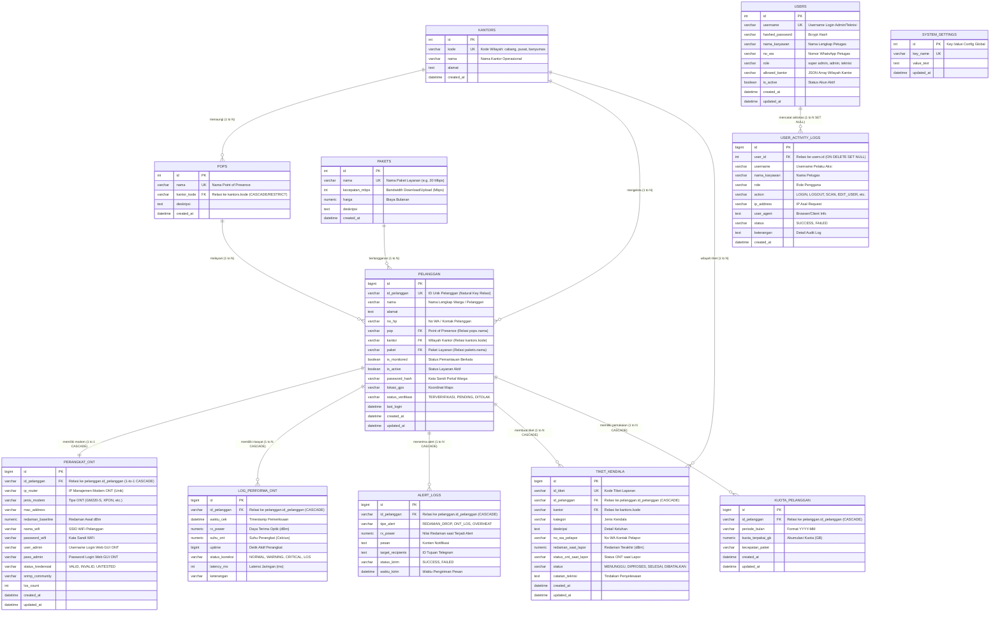

# Schema Database EdTeknoGuard (Ternormalisasi Penuh 3NF)

Dokumentasi arsitektur basis data relasional, kamus data (*data dictionary*), indeks optimasi, dan relasi antar-entitas untuk sistem **EdTeknoGuard**.

---

## 1. Entity Relationship Diagram (ERD)

---

## 2. Kamus Data & Integritas Relasional

### 2.1 Master Wilayah & Referensi
- **`kantors`**: Master entitas kantor operasional (`cabang`, `pusat`, `banyumas`).
- **`pops`**: Master Point of Presence yang terhubung ke kode kantor (`fk_pops_kantor`).
- **`pakets`**: Master paket layanan internet dan kecepatan bandwidth (Mbps).

### 2.2 Master Data Pelanggan (`pelanggan`) & Perangkat ONT (`perangkat_ont`) — 3NF Murni
- **Bebas Redundansi**: Tabel `pelanggan` murni menyimpan profil pelanggan, wilayah POP/Kantor, dan akun portal warga. Seluruh atribut teknis modem fisik telah didekomposisi ke `perangkat_ont`.
- **`perangkat_ont`**: Menyimpan IP router, jenis modem, MAC address, redaman baseline, kredensial Web GUI ONT, dan SSID/Password WiFi.
- **Relasi 1-to-1 CASCADE**: `perangkat_ont.id_pelanggan` $\rightarrow$ `pelanggan.id_pelanggan` (`ON DELETE CASCADE`).

### 2.3 Time-Series Log Redaman (`log_performa_ont`)
- **Foreign Key**: `id_pelanggan` $\rightarrow$ `pelanggan.id_pelanggan` (`ON DELETE CASCADE`).
- **Indeks**: 
  - `idx_pelanggan_waktu`: (`id_pelanggan`, `waktu_cek`) untuk query rentang grafik time-series.
  - `idx_log_status`: (`status_koneksi`) untuk filter status KPI.
  - `idx_log_waktu`: (`waktu_cek`) untuk pembersihan data usang (*retention policy*).

### 2.4 Log Notifikasi Alert (`alert_logs`)
- **Foreign Key**: `id_pelanggan` $\rightarrow$ `pelanggan.id_pelanggan` (`ON DELETE CASCADE`).
- **Indeks**:
  - `idx_alert_pelanggan_waktu`: (`id_pelanggan`, `waktu_kirim`) untuk evaluasi debounce anti-spam 30 menit.

### 2.5 Tiket Kendala Warga (`tiket_kendala`)
- **Foreign Key**: `id_pelanggan` $\rightarrow$ `pelanggan.id_pelanggan` (`ON DELETE CASCADE`) dan `kantor` $\rightarrow$ `kantors.kode` (`fk_tiket_kantor`).
- **Indeks**:
  - `idx_tiket_pelanggan_waktu`: (`id_pelanggan`, `created_at`).
  - `idx_tiket_status_kantor`: (`status`, `kantor`).

### 2.6 Monitoring Kuota (`kuota_pelanggan`)
- **Foreign Key**: `id_pelanggan` $\rightarrow$ `pelanggan.id_pelanggan` (`ON DELETE CASCADE`).
- **Indeks**:
  - `idx_kuota_pelanggan_periode`: (`id_pelanggan`, `periode_bulan`).

### 2.7 Pengguna Sistem NOC & Teknisi (`users`)
- **Fungsi**: Manajemen otentikasi admin kantor, super admin, dan teknisi lapangan.
- **Atribut Kontak**: `no_wa` menyimpan nomor WhatsApp aktif petugas untuk koordinasi dispatch kendala.

### 2.8 Audit Log Aktivitas (`user_activity_logs`)
- **Foreign Key**: `user_id` $\rightarrow$ `users.id` (`ON DELETE SET NULL`).
- **Indeks**:
  - `idx_activity_user_action`: (`username`, `action`).
  - `idx_activity_action_created`: (`action`, `created_at`).

### 2.9 Konfigurasi Sistem (`system_settings`)
- **Pola Key-Value Global**: Menyimpan konfigurasi global aplikasi (seperti interval monitoring dan default modem credentials).
