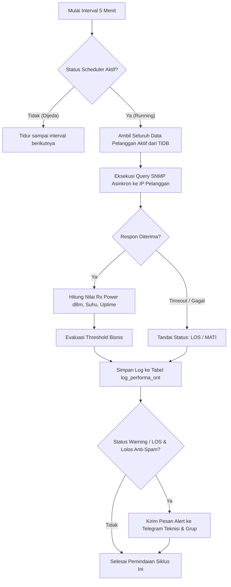

# Product Requirements Document (PRD): EdTeknoGuard

Dokumen ini mendefinisikan **alur kerja sistem, logika bisnis, dan kebutuhan fungsional** dari aplikasi **EdTeknoGuard** (Sistem Deteksi Dini & Monitoring Kualitas Jaringan ONT/Modem Berbasis Python FastAPI, TiDB Cloud, dan Telegram Alerting).

> 🔗 **Tautan Dokumen Terkait:**
> - 🎨 [Pedoman Desain & Tampilan (desain.md)](file:///c:/Users/r/Documents/Magang/EdTeknoGuard/desain.md) — Mengatur warna tampilan, komponen visual, dan mobile-first.
> - 🏗️ [Struktur File/Folder & Database (arsitektur.md)](file:///c:/Users/r/Documents/Magang/EdTeknoGuard/arsitektur.md) — Mengatur struktur direktori proyek dan skema tabel TiDB.
> - 📖 [README Utama Proyek](file:///c:/Users/r/Documents/Magang/EdTeknoGuard/README.md) — Gambaran umum dan panduan menjalankan sistem.

---

## 1. Latar Belakang & Tujuan Produk

Sebagai penyedia layanan internet (ISP lokal), kualitas redaman optik (*Rx Optical Power*) pada modem/ONT pelanggan merupakan indikator kesehatan jaringan yang paling vital. Sinyal optik yang memburuk (redaman drop) sering kali diakibatkan oleh:
- Kabel *dropcore* tertekuk atau terjepit di tiang/atap.
- Konektor FO (*fast connector* / adaptor) kotor atau berdebu.
- *Splice* kabel optik mengalami degradasi.
- Port ODP kendor.

**Tujuan EdTeknoGuard:**
1. **Mendeteksi dini** penurunan redaman sebelum pelanggan mengalami keluhan lambat/putus (*proactive maintenance*).
2. **Memberikan notifikasi otomatis seketika** ke tim teknisi via Telegram.
3. **Menyediakan data historis** performa modem dalam bentuk grafik agar teknisi bisa melihat tren apakah penurunan terjadi bertahap atau mendadak.
4. **Memberikan kemudahan bagi teknisi lapangan** untuk memantau status redaman lewat smartphone dengan antarmuka yang ringan dan cepat.

---

## 2. Pengguna & Hak Akses

- **Role Utama (Tahap 1):** **Administrator / NOC Team**
  - Mengontrol jalannya mesin pemantau (*Scheduler*).
  - Melakukan pemindaian manual (*on-demand scan*).
  - Melihat dashboard ringkasan metrik jaringan.
  - Membaca dan memfilter daftar seluruh pelanggan berdasarkan POP dan status kesehatan sinyal.
  - Menerima laporan gangguan otomatis di Telegram.

---

## 3. Alur Kerja Utama Sistem (Workflows)

### 3.1 Alur Pemantauan Otomatis (Periodic Scheduler - Tiap 5 Menit)



1. **Trigger Interval:** Sistem menjalankan *background job* setiap **5 menit sekali**.
2. **Pemeriksaan State:** Memeriksa apakah status pemantauan sedang `RUNNING` atau `STOPPED` (dapat diatur lewat dashboard).
3. **Pengambilan Target:** Mengambil seluruh daftar pelanggan aktif dari database TiDB.
4. **Polling SNMP:** Menembak protokol SNMP UDP 161 ke IP Manajemen ONT (`10.10.x.x`) sesuai OID merek masing-masing (Huawei, ZTE, GM220-S, dll).
5. **Penyimpanan Log:** Hasil pengukuran dicatat ke tabel `log_performa_ont` beserta waktu cek presisi.
6. **Trigger Alert:** Jika terdeteksi kondisi darurat atau penurunan sinyal, sistem mengirimkan pesan ke Telegram.

---

### 3.2 Alur Pemantauan Manual (On-Demand Trigger)

Selain berjalan otomatis tiap 5 menit, admin/teknisi dapat memicu pemeriksaan sewaktu-waktu:

1. **Tombol "Cek Redaman Sekarang" (Scan All):**
   - Menjalankan pemindaian serentak untuk seluruh pelanggan di database secara asynchronous.
   - Status antarmuka langsung menampilkan animasi *loading spinner* dan progress bar.
   - Setelah selesai, angka metrik KPI dan tabel pelanggan diperbarui seketika tanpa perlu refresh halaman browser (*via Alpine.js*).
2. **Tombol "Cek Live" (Single ONT Check):**
   - Tersedia di setiap baris/kartu pelanggan.
   - Berguna saat teknisi sedang berada di lokasi rumah pelanggan: setelah teknisi membersihkan konektor atau membenahi kabel dropcore, teknisi menekan tombol "Cek Live" untuk langsung melihat nilai redaman terbaru detik itu juga.

---

### 3.3 Alur Kontrol Mesin Pemantau (Jeda / Lanjutkan)

Admin dapat menghentikan sementara loop pemantauan berkala (misal saat sedang ada *maintenance* jaringan besar-besaran):
- **Aksi Stop:** Menekan tombol **"Jeda Monitoring"** $\rightarrow$ API memperbarui pengaturan `scheduler_status = 'STOPPED'` di database $\rightarrow$ background worker berhenti mengecek ONT.
- **Aksi Resume:** Menekan tombol **"Lanjutkan Monitoring"** $\rightarrow$ API memperbarui pengaturan `scheduler_status = 'RUNNING'` $\rightarrow$ background worker kembali aktif tiap 5 menit.

---

## 4. Logika Penilaian Kesehatan Redaman & Ambang Batas (Business Rules)

Sesuai arahan teknis lapangan, batas peringatan awal ditetapkan mulai **`-26.0 dBm`**:

```
           [ Hasil Pembacaan Rx Optical Power Dari ONT ]
                                  |
     +----------------------------+----------------------------+
     |                                                         |
Nilai: > -26.0 dBm                                       Nilai: <= -26.0 dBm
(Misal: -15 s/d -25.9 dBm)                                     |
     |                                       +-----------------+-----------------+
     v                                       |                                   |
[ STATUS: NORMAL ]                    Rentang: -26.0 s/d -31.9 dBm         Rentang: < -32.0 dBm
- Warna: Hijau Emerald                (Misal: -26.4 dBm, -27.8 dBm)        (Misal: -33.5 dBm)
- Simpan ke log DB.                          |                                   |
- Tidak kirim alert.                         v                                   v
                                      [ STATUS: WARNING ]                 [ STATUS: CRITICAL ]
                                      - Warna: Kuning Amber               - Warna: Merah Rose
                                      - Peringatan Awal Kerusakan         - Gangguan Parah
                                      - Simpan ke log DB                  - Simpan ke log DB
                                      - Kirim Alert Telegram              - Kirim Alert Telegram
```

### Klasifikasi Status:
1. **NORMAL (`> -26.0 dBm`):**
   - Sinyal optik dalam rentang prima. Pelanggan menikmati internet stabil.
2. **WARNING (`-26.0 dBm` s/d `-31.9 dBm`):**
   - **Peringatan Dini.** Pada `-27.0 dBm`, paket internet sudah berisiko mengalami *jitter* dan *packet loss*.
   - Tindakan: Sistem mencatat log dan mengirimkan notifikasi ke Telegram teknisi untuk dijadwalkan inspeksi fisik.
3. **CRITICAL (`< -32.0 dBm`):**
   - Sinyal sangat redup, ONT terancam putus-nyambung berulang kali (*intermittent link*).
   - Tindakan: Peringatan prioritas tinggi di dashboard dan Telegram.
4. **LOS / ONT MATI (SNMP Timeout / Ping RTO):**
   - Modem tidak merespon sama sekali.
   - Sistem melakukan evaluasi:
     - **Gangguan Massal:** Jika $\ge 3$ pelanggan pada POP/ODP yang sama mati bersamaan $\rightarrow$ indikasi kabel feeder/distribusi putus atau listrik gardu padam.
     - **Gangguan Individu:** Jika hanya 1 pelanggan mati $\rightarrow$ kemungkinan adaptor modem dicabut atau kabel dropcore lokal putus.

---

## 5. Alur Notifikasi Telegram Multi-Recipient

### 5.1 Mekanisme Pengiriman
1. Sistem membaca daftar penerima dari konfigurasi `.env` (`TELEGRAM_CHAT_IDS`).
2. Pesan dikirimkan secara paralel/asinkron menggunakan `HTTPX` ke:
   - ID Pengguna Telegram masing-masing teknisi.
   - ID Grup Telegram NOC / Operasional ISP.
3. **Format Pesan:**
   ```text
   ⚠️ [EdTeknoGuard] PERINGATAN REDAMAN DROP!

   👤 Pelanggan: Mas Andi (ID: 2072026320)
   📍 POP: Mini Klero
   🌐 IP ONT: 10.10.2.15
   📟 Jenis Modem: GM220-S XPON
   📊 Redaman Terkini: -27.40 dBm
   ⚡ Batas Aman: > -26.00 dBm
   ⏰ Waktu Cek: 10/09/2026 11:45:00 WIB

   🛠️ Tindakan: Segera periksa bending kabel dropcore atau kebersihan konektor FO di lokasi pelanggan.
   ```

### 5.2 Aturan Anti-Spam (Debounce Mechanism)
Untuk mencegah teknisi dibanjiri pesan Telegram setiap 5 menit:
- Setiap kali alert berhasil dikirim, sistem mencatat waktu kirim di tabel `alert_logs`.
- Jika pada siklus pemindaian 5 menit berikutnya pelanggan tersebut masih berstatus *Warning* dengan nilai redaman yang relatif sama ($\pm 0.5$ dBm), sistem **tidak akan mengirim ulang alert**.
- Alert baru akan dikirimkan kembali jika:
  1. Statusnya memburuk dari *Warning* menjadi *Critical* atau *LOS*.
  2. Gangguan masih berlangsung setelah melewati jeda **30 menit**.
  3. Status telah kembali normal lalu drop lagi di kemudian hari.

---

## 6. Alur Visualisasi Grafik Historis

Untuk mempermudah analisa teknis, dashboard menyediakan visualisasi grafik (Chart.js):
1. **Tab Harian (Hari Ini):**
   - Menampilkan fluktuasi redaman per jam sepanjang hari ini.
   - Membantu melihat apakah redaman drop terjadi pada jam tertentu (misal akibat suhu siang hari atau kabel tertiup angin).
2. **Tab Mingguan (7 Hari):**
   - Menampilkan rata-rata dan nilai terburuk redaman per hari dalam 1 pekan terakhir.
3. **Tab Bulanan (30 Hari):**
   - Menampilkan tren jangka panjang degradasi redaman kabel optik.
4. **Garis Ambang Batas (Threshold Line):**
   - Pada grafik selalu tergambar garis horizontal oranye putus-putus pada titik `-26.0 dBm` sebagai batas visual yang tegas.
